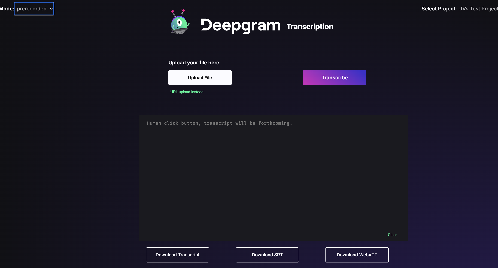
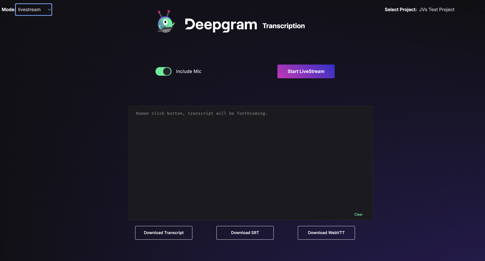
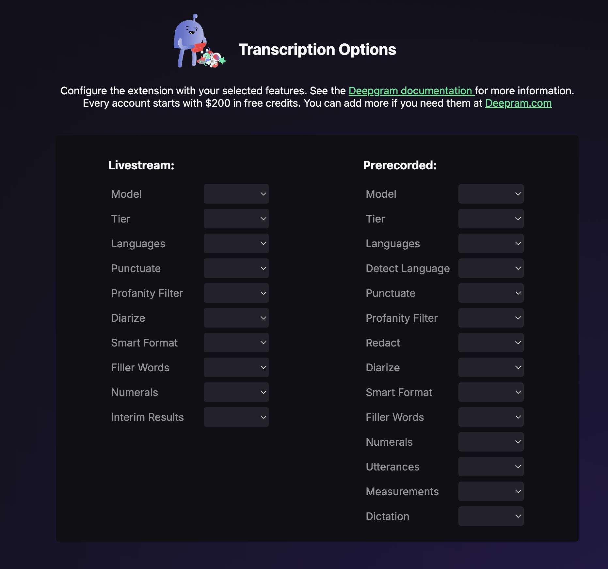

> This project is Experimental and not available as an official Chrome Extension.

# Deepgram Chrome Extension

This is the Deepgram Chrome Extension originally built by the Deepgram DX team. It allows users to try out Deepgram transcription, both prerecorded and live audio.

## How to use it

There are two main views: live streaming and prerecorded. There is also an options view for configuring which features to use in the transcription request.

### Live Streaming

A user can transcribe audio from the microphone, or they can toggle the microphone off and transcribe audio from a browser tab.

### Prerecorded

A user can upload an audio file from their computer or they can paste a URL of a hosted audio file.

### Options

This is where the user can select the different features (such as smart formatting, diarization, etc.)

## Running and installing the extension in dev mode

### Step 1: Project setup and install

1. Your Node version must be >= 18.
2. Clone the repository.
3. Type `npm install` to install the dependencies.
4. Type `npm start` to spin up the dev server.
5. Type `npm run build` to create the build folder

### Step 2: Adding the extension to Chrome

> Make sure the development server is running by running npm start.

1. Go to [chrome://extensions/](chrome://extensions/).
2. Toggle _Developer mode_ in the top right corner.
3. Click on _Load unpacked_.
4. Add the build folder for the project. The build folder can be found in `your_directory_location/deepgram-chrome-extension/build`
5. Now the build project should be loaded into your chrome extensions.

## Step 3: Using the extension in Chrome

1. Click on the puzzle piece icon in the Chrome Tool Bar to see all the extensions available to you.
2. You should now see the Deepgram icon.  Note: You cn also Pin the icon to you tool bar if you wish for easy access.
3. Click on extension icon to see it working.

## Step 4: Login in and accessing Deepgram

> If you don't have a deepgram account you can [sign up here](https://console.deepgram.com/signup)

1. In order to use the extension you'll need to have an active login session to [console.deepgram.com](https://console.deepgram.com/)
2. Login to the Deepgram Console if not logged in.
3. Click on the Deepgram Extension icon and you can now transcribe audio.

## Extension Features

* Toggle between pre-recorded and live stream modes.
* Upload a file from a local source or from a URL for pre-recorded audio.
* Transcribe live from a Microphone.
* Download a transcript.
* Download SRT or WEBVTT formats.
* Set different Transcriptions Options.

### Pre-Recorded

### Live

### Setting Transcription Options

> You can access this feature by clicking on the extension icon > settings.

## Getting Help

We love to hear from you so if you have questions, comments or find a bug in the
project, let us know! You can either:

- [Open an issue in this repository](https://github.com/deepgram/deepgram-chrome-extension/issues)
- [Join the Deepgram Github Discussions Community](https://github.com/orgs/deepgram/discussions)
- [Join the Deepgram Discord Community](https://discord.gg/xWRaCDBtW4)